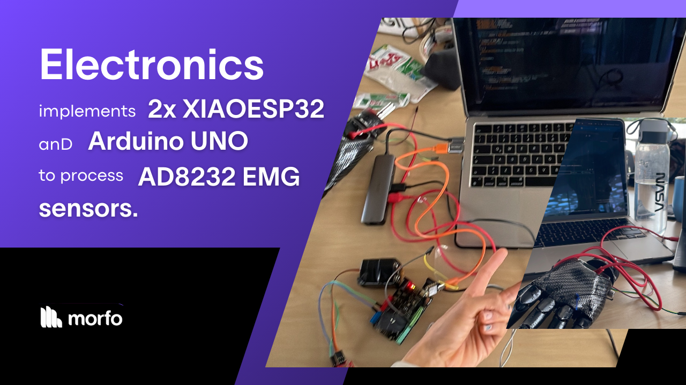

# Midas Prosthetic Arm – Electronics and Signal Processing

## Components
The Midas prosthetic arm operates through an advanced combination of **microcontrollers** and **sensors**. The system’s core consists of:

- **Arduino Uno**.
- **Two XIAO ESP32 microcontrollers**.

The **Arduino Uno** processes analog signals from the **AD8232 electromyographic sensor**, which captures muscle activity from the user’s forearm.

## Process

### Analog signal interpretation
The Arduino Uno is responsible for processing analog signals received from the AD8232 electromyographic sensor. This sensor captures muscle activity from the user’s forearm, converting the biological signals into data that the prosthetic can interpret.

###  Analog signal Filtering
These signals are then passed on to the first XIAO ESP32, located within the arm. This microcontroller applies a secondary filtering process to the signals, analyzing their intensity and duration to determine the user’s intent.

[Next: Key Features 🦾](./midas-features.md)
